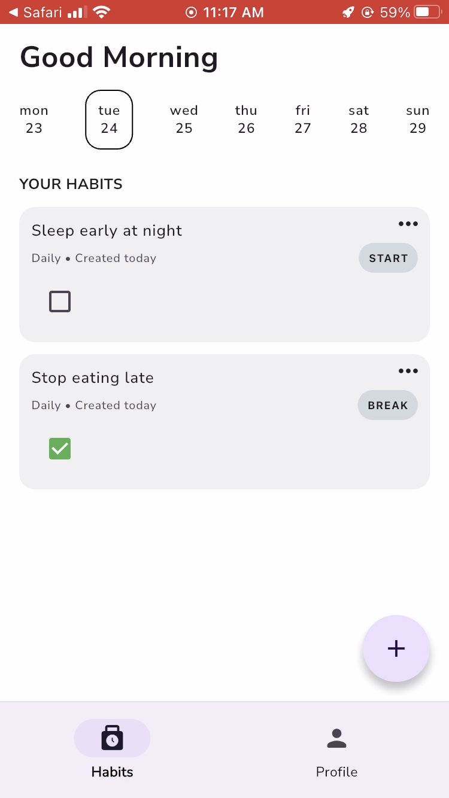
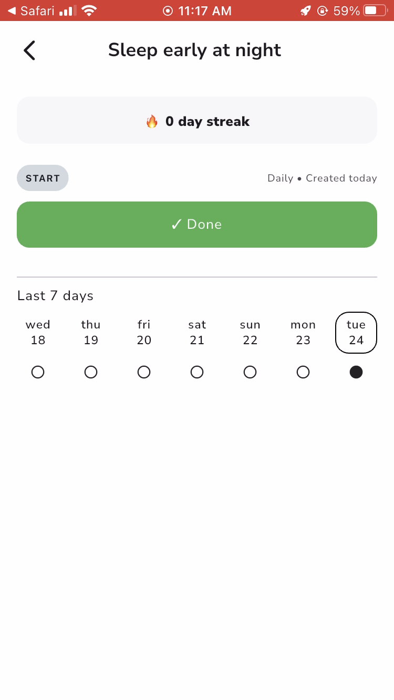
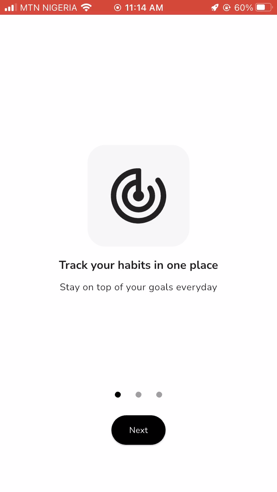
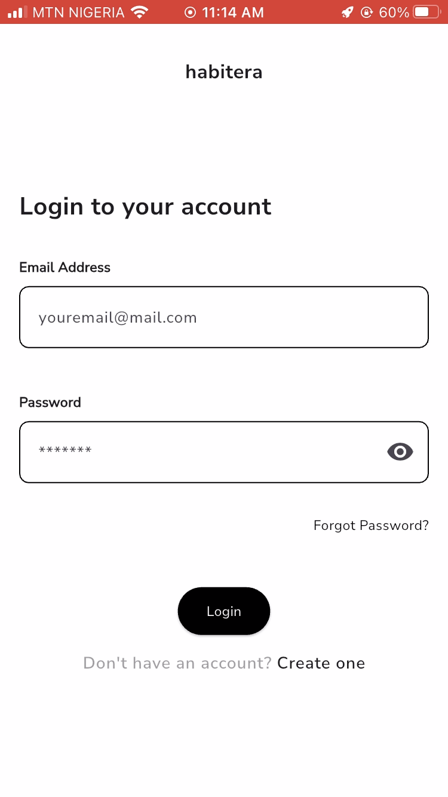

# Habitera
A habit tracking app built with Flutter that helps you build good habits and break bad ones.

## Screenshots
 

## Features

- Create and track daily habits
- Check in daily and track streaks
- Last 7 days completion indicator
- Build new habits or break bad ones
- Full authentication — signup, login, forgot password, email verification
- Profile screen with account details

## Tech Stack

- Flutter — UI framework
- Supabase — authentication and PostgreSQL database
- Riverpod — state management with code generation
- GoRouter — navigation and deep linking
- Isar — local database (migrated to Supabase)

## Architecture
The app follows a repository pattern — UI talks to providers, providers talk to repositories, repositories talk to Supabase. State is managed with Riverpod notifiers, with optimistic updates for instant UI feedback on checkins.

## Download
(Play Store link once published)